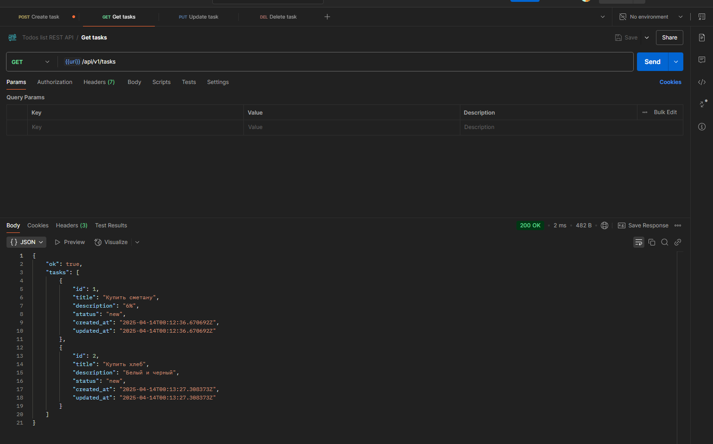

# Todo List API

RESTful API for task management (todo list), developed with Go using Fiber framework and PostgreSQL.

## Technologies

- **Go 1.23**
- **Fiber** - fast HTTP web framework
- **PostgreSQL** - relational database
- **Migrations** - database schema management
- **Validator** - input data validation

## Getting Started

### Requirements

- Go 1.23+
- PostgreSQL 16+
- Docker (optional)

### Installation

1. Clone the repository:
   ```
   git clone https://github.com/yourusername/todo-list-api.git
   cd todo-list-api
   ```

2. Install dependencies:
   ```
   go mod download
   ```

3. Configure the configuration file in `configs/config.yml`

### Running

#### Development

To run in development mode, execute the script:
```
./cmd/run_dev.sh
```

#### Production

To build and run in production mode, execute the script:
```
./cmd/build_prod.sh
```

## API Endpoints

- **GET /api/v1/tasks** - get all tasks
- **POST /api/v1/tasks** - create a new task
- **PUT /api/v1/tasks/:id** - update a task
- **DELETE /api/v1/tasks/:id** - delete a task

## Testing

You can use the Postman collection located in the `postman/Postman collection.json` directory for testing the API.

### API Usage Examples

#### Creating a Task (POST)


Result:


#### Getting a Task (GET)



#### Updating a Task (PUT)


#### Deleting a Task (DELETE)


Result:


## Migrations

Database migrations are located in the `db/migrations/files/` directory. Migrations are executed automatically when the server starts.
